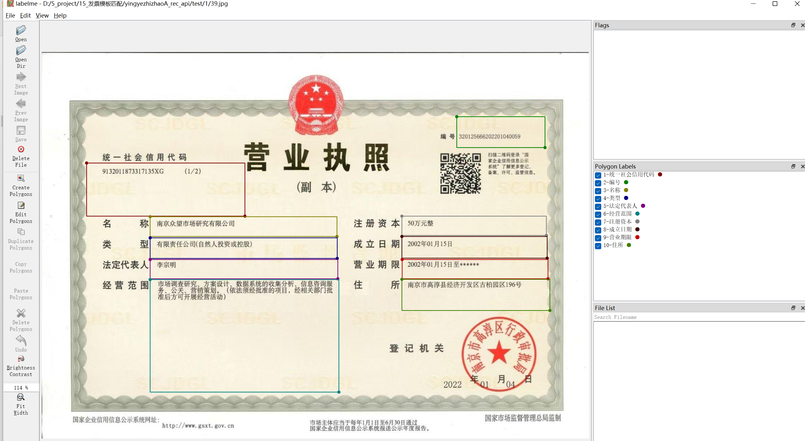
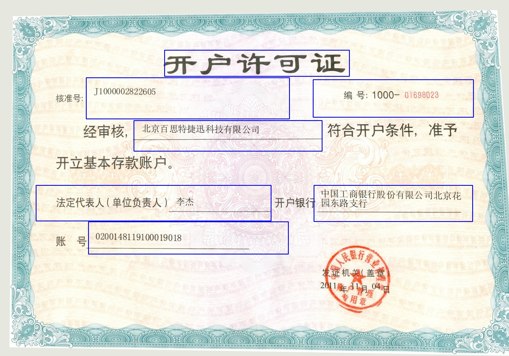
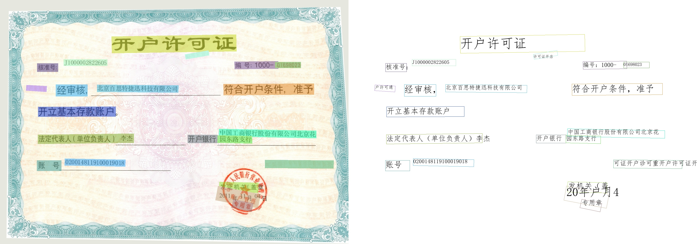
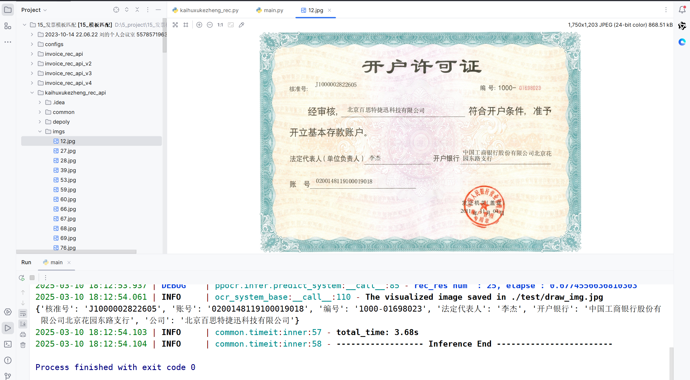

# 基于图像关键字ocr检测框的透视变换模板匹配

## **一、项目简介**
基于“营业执照”、“开户许可证”等关键词的ocr检测框角点进行透视变换模板匹配，进而提取出营业执照、开户许可证等图片结构化的关键信息。不用大规模训练模型！

**步骤：**
 1. OCR关键点检测。
 2. 待检测图片与模板图片生成四点组合。
 3. 评估四点组合透视变换的质量。
 4. 图像透视变换。
 5. 二次OCR识别。
 6. 模板匹配与结构化数据提取。
 7. 后处理并过滤结果。

**项目图片：**

首先使用labelme标注软件做模板，如下图所示：

营业执照模板

开户许可证模板

模板匹配

ocr识别

识别结果

## **二、 联系方式**
如需要完整项目，请联系

